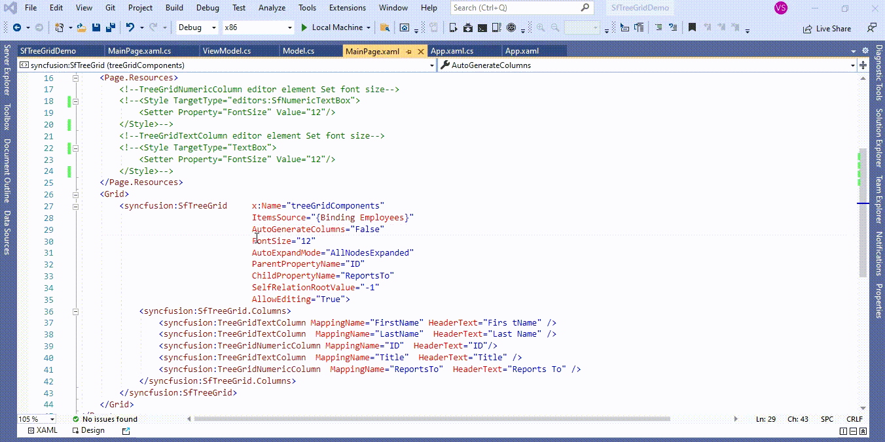

# How to change the FontSize edit mode in UWP TreeGrid (SfTreeGrid)?

## About the sample
This example illustrates how to change the FontSize edit mode in [UWP TreeGrid](https://www.syncfusion.com/uwp-ui-controls/treegrid) (SfTreeGrid)?

[UWP TreeGrid](https://www.syncfusion.com/uwp-ui-controls/treegrid) (SfTreeGrid) **FontSize** changed only applied in the display text. **TextBox** loaded as editor element in [TreeGridTextColumn](https://help.syncfusion.com/cr/uwp/Syncfusion.UI.Xaml.TreeGrid.TreeGridTextColumn.html) when enter into edit mode **FontSize** not changed. You can change the **FontSize** in edit mode by setting the **FontSize** for **TextBox**. 

```XML

<Page.Resources>
        <!--TreeGridNumericColumn editor element Set font size-->
        <Style TargetType="editors:SfNumericTextBox">
            <Setter Property="FontSize" Value="12"/>
        </Style>
        <!--TreeGridTextColumn editor element Set font size-->
        <Style TargetType="TextBox">
            <Setter Property="FontSize" Value="12"/>
        </Style>
</Page.Resources>

```

[UWP TreeGrid](https://www.syncfusion.com/uwp-ui-controls/treegrid) (SfTreeGrid) provides support for various built-in column types. Each column has its own properties and renderer for more details please refer the below documentation link.

**Documentation Link:** https://help.syncfusion.com/uwp/treegrid/columntypes 




Take a moment to peruse the [UWP TreeGrid - Editing](https://help.syncfusion.com/uwp/treegrid/editing) documentation, where you can find about editing with code examples.

## Requirements to run the demo
Visual Studio 2015 and above versions
